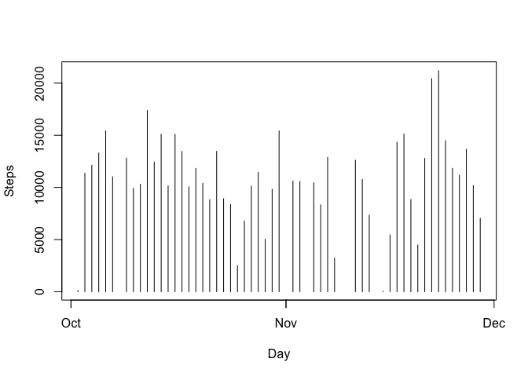
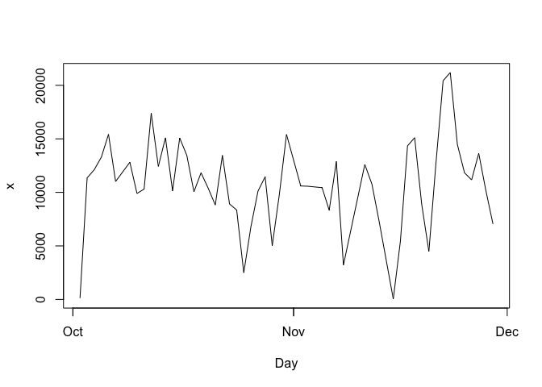
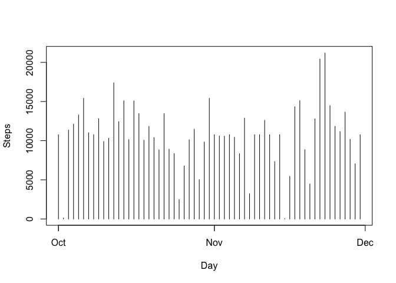
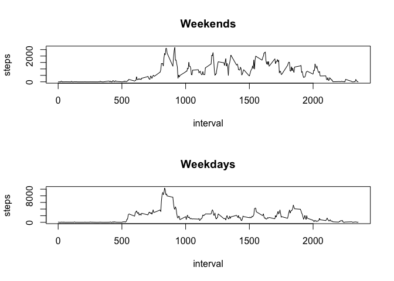

# Reproducible Research: Peer Assessment 1


## Loading and preprocessing the data


Download the zipfile, unzip it and load the csv file


```r
zipUrl <- "https://d396qusza40orc.cloudfront.net/repdata%2Fdata%2Factivity.zip"
dir.create('./data')
download.file(zipUrl, destfile = "./data/activity.zip", method="curl")
unzip("./data/activity.zip", exdir = "./data")
activityData <- read.csv("./data//activity.csv")
```

Make the date column actual dates and remove NA measurements.


```r
activityData$date <- ymd(activityData$date)
filteredData <- activityData[!is.na(activityData$steps),]
```

## What is mean total number of steps taken per day?

Sum and plot steps by day

```r
sums <- aggregate(filteredData$steps, by=list(Day=filteredData$date), FUN=sum)
plot(sums, type="h", ylab="Steps")
```

 


```
## [1] "Mean steps per day: 10766.1886792453"
```

```
## [1] "Median steps per day: 10765"
```

## What is the average daily activity pattern?
Aggregate by interval and take the average


```r
intvlSums <- aggregate(list(steps=filteredData$steps), by=list(interval=filteredData$interval), FUN=sum)
intvlSums$steps <- intvlSums$steps / length(unique(activityData$date))
plot(sums, type="l")
```

 


```
## [1] "Interval with most number of step is: 835"
```

## Imputing missing values


```
## [1] "Number of rows missing data:  2304"
```

Setting missing rows to the mean for that interval


```r
grouped <- group_by(activityData, interval)
withMean <- mutate(grouped, meanIntvl=mean(steps, na.rm=TRUE))
withMean$steps <- ifelse(is.na(withMean$steps), withMean$meanIntvl, withMean$steps)
```


Sum and plot by day

```r
sums <- aggregate(withMean$steps, by=list(Day=withMean$date), FUN=sum)
plot(sums, type="h", ylab="Steps")
```

 


```
## [1] "Mean steps per day: 10766.1886792453"
```

```
## [1] "Median steps per day: 10766.1886792453"
```

Estimating missing data seems to have no effect on mean and median steps per day

## Are there differences in activity patterns between weekdays and weekends?

Calculate day type and plot steps by type


```r
dayType <- mutate(withMean, dayCat=ifelse(weekdays(date) == "Saturday" | weekdays(date) == "Sunday", "weekend", "weekday"))

weekdays <- dayType[dayType$dayCat=="weekday",]
weekends <- dayType[dayType$dayCat=="weekend",]

weekendSums <- aggregate(list(steps=weekends$steps), by=list(interval=weekends$interval), FUN=sum)
weekends$steps <- weekends$steps / length(unique(activityData$date))

weekdaySums <- aggregate(list(steps=weekdays$steps), by=list(interval=weekdays$interval), FUN=sum)
weekdays$steps <- weekdays$steps / length(unique(activityData$date))

par(mfrow=c(2,1))
plot(weekendSums, type="l", main="Weekends")
plot(weekdaySums, type="l", main="Weekdays")
```

 

